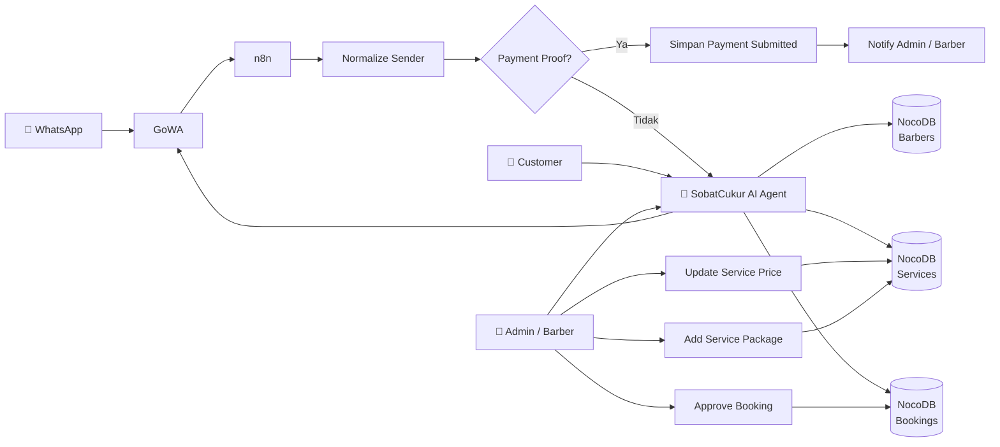

# 💈 sobatCukur — AI Agent Barbershop WhatsApp

> **SobatCukur** adalah AI Agent layanan barbershop berbasis WhatsApp yang membantu customer mendapatkan informasi barber dan layanan, mengecek ketersediaan slot, melakukan booking, serta mendukung proses pembayaran dan approval melalui otomasi **n8n + GoWA + NocoDB + PostgreSQL**.

---

## 📌 Tentang Project

SobatCukur dirancang sebagai asisten WhatsApp untuk operasional barbershop.

Agent menangani dua kelompok pengguna:

| Pengguna | Fungsi |
|---|---|
| 👤 **Customer** | Informasi barber, layanan, harga, ketersediaan slot, booking, dan pembayaran |
| 💈 **Barber / Admin** | Melihat booking dan jadwal serta mengelola layanan, harga, paket, dan approval |

> **Catatan:** Admin internal saat ini menggunakan nomor `082192791079` dengan format internal `6282192791079`. Nomor tersebut diperlakukan sebagai admin/barber, bukan customer.

---

# ✨ Fitur Utama

- 💈 Menampilkan daftar barber aktif
- 💇 Menampilkan layanan, harga, durasi, dan spesialisasi
- 🕐 Mengecek slot yang benar-benar tersedia
- 📅 Membuat booking berdasarkan barber, tanggal, dan slot
- 📝 Menyimpan catatan booking
- 💰 Mengelola harga layanan oleh admin
- 📦 Menambahkan paket layanan oleh admin
- 📋 Melihat booking dan jadwal operasional
- 🧾 Menerima bukti pembayaran dalam bentuk teks maupun media
- ✅ Melakukan approval pembayaran/booking oleh admin
- 🔔 Mengirim notifikasi kepada pihak terkait melalui WhatsApp

---

# 🏗️ Arsitektur Sistem



### Komponen

| Komponen | Peran |
|---|---|
| **WhatsApp** | Media komunikasi customer dan barber |
| **GoWA** | Gateway WhatsApp dan komunikasi pesan |
| **n8n** | Orkestrasi workflow dan AI Agent |
| **NocoDB** | Pengelolaan data operasional |
| **PostgreSQL** | Database untuk NocoDB |
| **AI Agent** | Memahami permintaan pengguna dan memilih tool yang sesuai |

---

# 🔄 Alur Customer

```text
Customer
   ↓
WhatsApp
   ↓
GoWA
   ↓
n8n Webhook
   ↓
Normalize Sender
   ↓
SobatCukur AI Agent
   ↓
NocoDB / Workflow Tools
   ↓
GoWA
   ↓
WhatsApp Customer
```

### Proses Booking

1. Customer menanyakan barber, layanan, harga, atau jadwal.
2. Agent mengambil informasi dari NocoDB.
3. Jika customer ingin booking, barber dan tanggal ditentukan.
4. Agent **wajib memanggil `Check Available Slots`**.
5. Customer memilih salah satu slot yang tersedia.
6. Agent menanyakan catatan khusus jika diperlukan.
7. Agent menampilkan ringkasan booking.
8. Booking hanya dibuat setelah customer memberikan **konfirmasi eksplisit**.
9. Booking dibuat dengan status yang sesuai dan customer diarahkan ke alur pembayaran.

> ⚠️ **Jam kerja barber tidak otomatis berarti slot tersedia.** Ketersediaan harus diperiksa menggunakan workflow/tool `Check Available Slots`.

---

# 💈 Alur Admin / Barber

Admin atau barber dapat melakukan operasi seperti:

```text
daftar harga
cek harga layanan ID 2
edit harga layanan ID 2 menjadi Rp130.000
buat paket layanan potong + cuci
cek jadwal barber
approve booking #ID
```

### Hak akses

Customer tidak diberikan akses untuk:

- Mengubah harga layanan
- Menambahkan paket layanan
- Melakukan approval booking

Operasi admin menggunakan ID booking yang jelas untuk mengurangi risiko salah target.

> Approval admin tidak mensyaratkan `payment_proof_url`. Bukti pembayaran merupakan bagian dari alur customer, bukan syarat wajib untuk approval admin.

---

# 💳 Status Booking & Pembayaran

Alur pembayaran utama:

```text
pending_payment
       ↓
payment_submitted
       ↓
confirmed
```

Customer dapat mengirimkan bukti pembayaran melalui teks maupun media.

Setelah bukti diterima, workflow dapat menyimpan status `payment_submitted` dan mengirimkan notifikasi kepada admin/barber untuk proses selanjutnya.

---

# 🤖 Komponen AI & Workflow

Workflow utama dan sub-workflow yang digunakan dalam project:

| Workflow / Tool | Fungsi |
|---|---|
| `Barber Service Catalog` | Mengelola informasi katalog layanan |
| `search_active_barbers` | Mencari barber yang aktif |
| `Check Available Slots` | Mengecek slot yang tersedia |
| `Create Booking` | Membuat data booking |
| `Barber Update Service Price` | Mengubah harga layanan |
| `Barber Add Service Package` | Menambahkan paket layanan |
| `Setujui Pembayaran` | Memproses approval |
| `Notify Barber Payment Proof` | Memberikan notifikasi bukti pembayaran |

---

# 🗄️ Database

SobatCukur menggunakan **NocoDB** sebagai database interface dengan **PostgreSQL** sebagai database backend.

### Data utama

```text
Barber
Customer
Services
Service Packages
Bookings
Payment Status
Payment Proof Metadata
```

Relasi data digunakan untuk menghubungkan customer, barber, layanan, booking, dan informasi pembayaran.

---

# 🔌 Integrasi

| Service | Keterangan |
|---|---|
| **GoWA** | WhatsApp Gateway |
| **n8n** | Automation & AI Agent |
| **NocoDB** | Database Management |
| **PostgreSQL** | Database Backend |

Endpoint yang digunakan pada environment project:

```text
n8n    → https://n8n.saidhr.my.id
GoWA   → https://wa.saidhr.my.id
NocoDB → https://noco.saidhr.my.id
```

> Endpoint di atas merupakan konfigurasi environment project. Untuk deployment lain, sesuaikan dengan domain/host masing-masing.

---

# ⚙️ Setup & Deployment

## 1. Persiapkan n8n

SobatCukur dijalankan menggunakan n8n dan dapat dideploy menggunakan Docker.

Workflow dapat di-import ke instance n8n melalui:

```text
n8n
→ Workflows
→ Import from File
→ pilih file workflow .json
```

## 2. Persiapkan NocoDB

Pastikan NocoDB dapat diakses oleh n8n dan database PostgreSQL berjalan dengan baik.

## 3. Persiapkan GoWA

GoWA digunakan sebagai gateway WhatsApp untuk menerima dan mengirim pesan.

## 4. Hubungkan Credential

Credential yang diperlukan harus dibuat atau dihubungkan kembali pada environment tujuan.

> Credential tidak ikut dibagikan dalam repository publik.

---

# 🧪 Verifikasi

Sebelum workflow digunakan, lakukan pengujian:

- [ ] Customer dapat mengirim pesan melalui WhatsApp
- [ ] GoWA menerima pesan
- [ ] n8n menerima webhook
- [ ] Customer dikenali dengan benar
- [ ] Agent dapat mencari barber
- [ ] Agent dapat mencari layanan
- [ ] `Check Available Slots` mengembalikan slot yang sesuai
- [ ] Customer dapat melakukan konfirmasi booking
- [ ] `Create Booking` menyimpan booking
- [ ] Status pembayaran dapat diperbarui
- [ ] Admin/barber menerima notifikasi
- [ ] Admin dapat melakukan approval menggunakan ID booking

---

# 🔐 Keamanan

Jangan pernah memasukkan credential atau data produksi ke repository publik.

Jangan commit:

```text
.env
API Key
GoWA Token
NocoDB Token
OpenAI / AI API Key
n8n Credentials
Database Password
Database Dump Produksi
Webhook Secret
```

Export workflow publik harus menggunakan versi yang sudah disanitasi.

---

# 📁 Struktur Repository

Struktur repository yang disarankan:

```text
sobat-cukur-ai-agent/
│
├── README.md
│
├── workflow/
│   ├── barber-customer-service.json
│   ├── check-available-slots.json
│   ├── create-booking.json
│   └── backup-db.json
│
├── documentation/
│   ├── architecture.md
│   ├── customer-flow.md
│   ├── barber-admin-flow.md
│   ├── database.md
│   └── installation.md
│
└── images/
    ├── architecture.png
    ├── customer-workflow.png
    ├── barber-workflow.png
    └── database.png
```

---

# 📌 Batasan & Catatan

- Agent bergantung pada model AI dan workflow/tool yang terhubung.
- Credential harus dibuat ulang atau dihubungkan kembali ketika project dipindahkan ke instance n8n lain.
- Pengujian edit harga dan approval sebaiknya menggunakan data uji atau ID yang memang diizinkan untuk diubah.
- Ketersediaan slot harus diperiksa melalui workflow ketersediaan, bukan hanya berdasarkan jam operasional.
- Endpoint dan credential harus disesuaikan dengan environment deployment.

---

# 👥 Project Team

| Role | Responsibility |
|---|---|
| AI Agent | Conversation, intent handling, dan tool calling |
| Automation | n8n workflow & integration |
| Database | NocoDB & PostgreSQL |
| WhatsApp Integration | GoWA |

---

## 🚀 Project Status

- [x] Customer Service Agent
- [x] Barber / Admin Agent
- [x] Barber Catalog
- [x] Service Catalog
- [x] Availability Check
- [x] Booking System
- [x] Payment Submission
- [x] Payment Approval
- [x] WhatsApp Integration
- [x] NocoDB Integration
- [x] PostgreSQL Backend

---

### sobatCukur

**AI-powered WhatsApp assistant for barbershop operations.**
